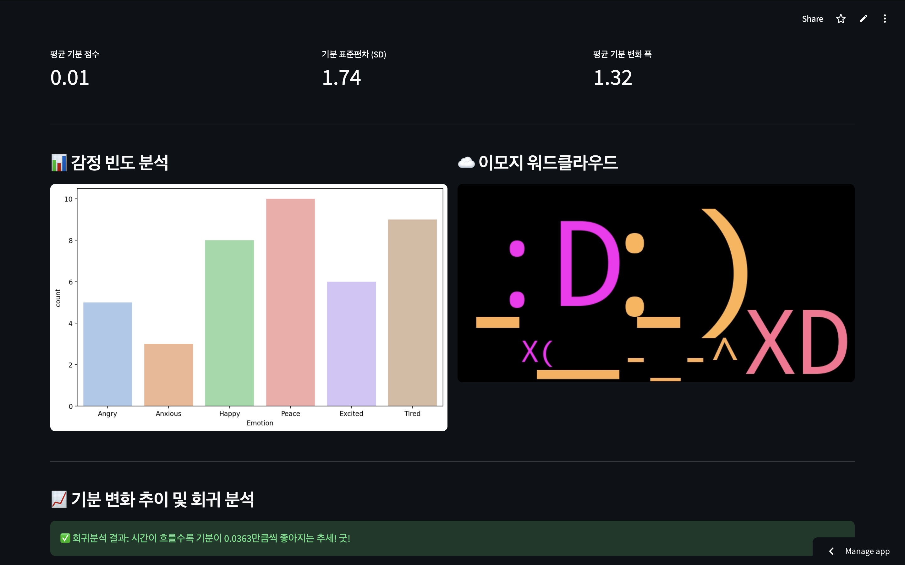
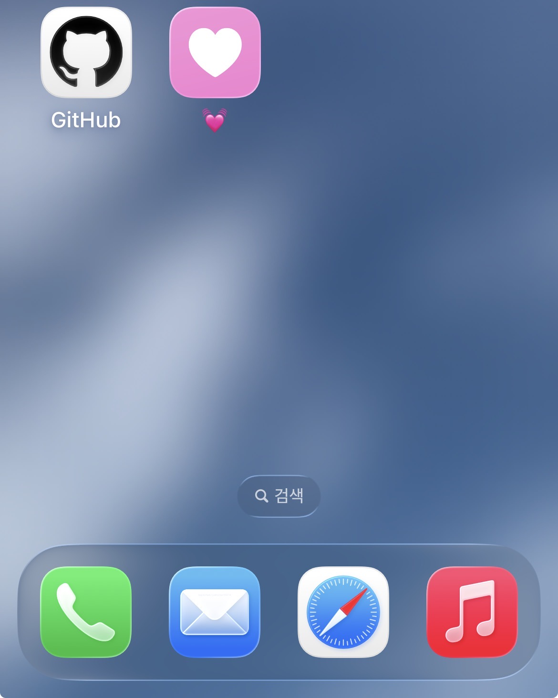

# Mood-Analytics: Descriptive Statistics of My (Rollercoasting) Moods


## 0. Introduction: The Science of "Me"
Data is most powerful when it reveals the uncomfortable truth. While the **Pico W Mood-Tracker** device focuses on the tactile "Click" to capture fleeting moments of joy or existential dread, this project applies rigorous descriptive statistics to analyze the wreckage.

We aren't just looking at feelings; we are calculating the mean, variance, and emotional trajectory of a human being who probably needs a nap.

### Project Ecosystem
This analytics suite is the second half of a two-part ecosystem:
1. **The Logger ([PicoW-Mood-Tracker](https://github.com/KELEE0810/pico-w-mood-tracker))**: An IoT device that logs moods to Google Sheets.
2. **The Analyzer (This Repo)**: A Python-based suite that fetches, processes, and visualizes that data.
3. **The Dashboard (Web)**: (NEW!) A Streamlit-powered realtime web interface for instant visual feedback.

---

## 1. Key Analytical Features

### 1. Trend Forecasting (Linear Regression)


By mapping qualitative mood labels to quantitative scores, the system calculates a **Regression Slope** to determine your emotional trajectory over time.
* **Positive Slope**: Indicates a steady upward trend in your well-being. **Negative Slope**: Suggests a downward trend, signaling a need for rest.
*  💡 *Or just calculating if my happiness is trending upward or if I'm headed for a statistical anomaly.*

### 2. Emotional Volatility Analysis


This script analyzes the stability of your emotions through advanced statistical metrics:
* **Standard Deviation (SD)**: Measures how much your mood scores deviate from the average.
* **Average Mood Swing**: Calculates the mean of absolute differences between consecutive records to quantify emotional turbulence.
* **Volatility Visualization (VIX)**: A dedicated chart that plots score changes between entries to identify stability patterns.
*  💡 *Or just measuring how quickly I flip from "I love my hobby" to "Why on earth am I doing this in my free time?"*


### 3. Visual Insights


* **Frequency Analysis**: Identify dominant emotions using Seaborn-powered bar charts.
* **Time-Series Tracking**: Maps every emotional data point over a timeline to identify specific patterns.
* **Emoji WordCloud**: Generates an intuitive visual cloud of your most frequently recorded emojis.
*  💡 *Or just turning raw emotional chaos into pretty bar charts because numbers are annoying.*

### 4. Realtime Web Dashboard (Streamlit)

Skip the local scripts and monitor your emotional state directly in your web browser.
* **Auto-Refresh**: Automatically fetches and syncs with Google Sheets every 300 seconds (5 minutes) to keep your data current.
* **Security**: Features a built-in password protection layer to ensure your personal mood logs remain private.
---

## 2. Quick Start for Local

### 1. Installation
Install the necessary dependencies:
```bash
pip install pandas seaborn matplotlib scikit-learn wordcloud
```

### 2. Connection
Update the url variable in main.py with your Google Sheets CSV URL:

1) Go to Google Sheets > File > Share > Publish to web.
2) Select Comma-separated values (.csv) and click Publish.
3) Copy and paste the link into the code.

### 3. Usage
For analysis: python3 main.py

---

## 3. Deployment via Streamlit Community Cloud


> *Please ignore Korean. You'll see it in English.*

You can host this dashboard for free using [Streamlit Community Cloud](https://streamlit.io/cloud), syncing it directly with your GitHub repository.

### 1. Push to GitHub
Ensure your repository contains the following essential files:
* **`mood-board-web.py`**: The main application code. *This code must be modified for your own google sheets' url of .csv and password before use.*
* **`requirements.txt`**: List of dependencies including `streamlit`, `pandas`, `matplotlib`, `seaborn`, `wordcloud`, and `scikit-learn`.

### 2. Connection
Update the url variable in main.py with your Google Sheets CSV URL:

1) Go to Google Sheets > File > Share > Publish to web.
2) Select Comma-separated values (.csv) and click Publish.
3) Copy and paste the link into the code.

### 3. Connect to Streamlit Cloud
1. Log in to [Streamlit Community Cloud](https://share.streamlit.io/) using your GitHub account.
2. Click **"New app"**.
3. Select your repository, branch (usually `main`), and the main file path (`mood-board-web.py`).

### 4. Public vs. Private Repositories
* **Public Repository**: Streamlit can access and deploy your app instantly without extra configuration.
* **Private Repository**: 
    * During the "New app" setup, you must grant Streamlit permission to access your private repositories.
    * **Pro Tip**: Use **Streamlit Secrets** (Advanced settings) to manage sensitive information like your Google Sheets URL or passwords instead of hardcoding them in the script.

### 5. Continuous Deployment & Instant Access
* **Auto-Update**: Any changes you `git push` to your GitHub repository will be automatically detected and redeployed within seconds.
* **Universal Access**: Once deployed, Streamlit provides a unique URL. You can access your mood dashboard instantly from any **PC, Tablet, or Smartphone** without any additional setup.

---

## 4. Tips for Smartphone Use 



### For iOS (iPhone/iPad) via Shortcuts app
1. Open the **Shortcuts** app.
2. Tap the **+** icon (Top right) > **Add Action**.
3. Search for **"Open URLs"** and select it.
4. Paste your Streamlit Dashboard link into the **URL** field.
5. Tap the **Share icon** (at the bottom) or the **Settings icon** (at the top) and select **"Add to Home Screen"**.
6. Choose your preferred name and a custom photo/icon for your dashboard.

### For Android (Galaxy/Pixel) via Web Shortcut Widget
1. Copy your Streamlit Dashboard link to your clipboard.
2. Long-press an empty space on your **Home Screen**.
3. Tap **Widgets** and look for the **Chrome** or **Browser** category.
4. Drag and drop the **"Chrome Bookmark"** or **"Custom Shortcut"** widget to your home screen.
5. Select your dashboard from your bookmarks or paste the URL if prompted.
6. This method bypasses common "Add to Home Screen" caching issues.

> 🤔 **Why this way?**: These native OS methods launch the URL fresh, preventing the 500 errors sometimes caused by the progressive web app (PWA) cache of the browser.
